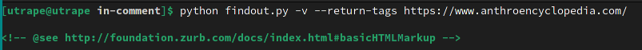
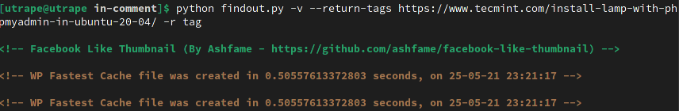
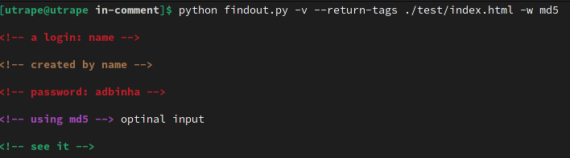

<h1 align="center">Find Out in Comment</h1>
<h2 align="center" >
Find sensetive comment out in HTML<br><br>
    <a href="https://github.com/PabloEmidio/Findout-in-Comment/stargazers"></a>
    <a href="https://github.com/PabloEmidio"></a>
</h2>

---

# ⚈ About
This is a pre-attack hacker tool that searches for sensitives words in HTML comments tag and return some informations which can help in your attack process

---

# ⚈ Requirements

```
pip3 install -r requirements.txt
```
---

# ⚈ Use example

<h3 align="center">Find default sensitives words out, showing entire tag comment and allowing to show comments with html code</h3>
<p align="center">

  <br>
</p>

---

<h3 align="center">Find default sensitives words out, showing entire tag comment, allowing to show comments with html code and taking the word "tag" out for the search</h3>

<p align="center">
  <br>
</p>

---

<h3 align="center">Find default sensitives words out in local file html, showing entire tag comment, allowing to show comments with html code and looking for optional word "md5"</h3>

<p align="center">
  <br>
</p>


---


# ⚈ Tech Stack

The following tools were used in the construction of the project:

- [Python](https://www.python.org/)
- [Parsel](https://pypi.org/project/parsel/)

---

# ⚈ Bugs and Features
<p>
Please report any type of bug. Remember that this is an open source project and will evolve with everyone's help. :)<br>
Any report will be read and will get due attention
</p><br>
<p>
New features are being done and new ideas are being created always that possible...<br>
new ideas will be accepted...
</p>
